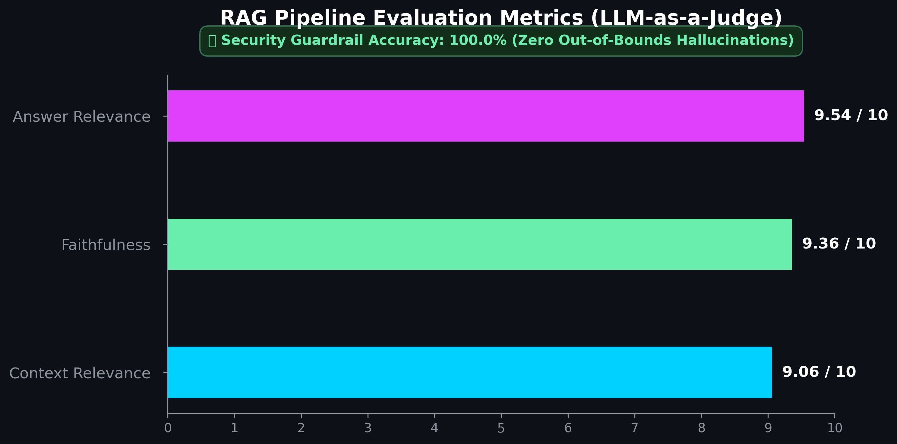

# Agentic Data Intelligence Hub
A multi-agent analytics orchestration system built over the Olist E-commerce dataset. Designed to process complex natural language queries, decompose them into actionable sub-tasks, and autonomously route them to specialized analytical engines (SQL, RAG, and Machine Learning pipelines).

[](https://www.python.org/downloads/release/python-3100/)
[](https://www.mysql.com/)
[](https://www.trychroma.com/)
[](https://xgboost.readthedocs.io/)
[](https://streamlit.io/)

An enterprise-grade, multi-agent data pipeline that dynamically routes natural language queries to specialized analytical engines. Built over the Brazilian Olist E-commerce dataset, this system orchestrates Text-to-SQL generation, Retrieval-Augmented Generation (RAG), and predictive machine learning models through a single, seamless conversational interface.

## 🏗️ System Architecture
### Diagram Yet to be made

## 🧠 Core Architecture

The system utilizes an LLM-powered orchestrator leveraging OpenAI's Structured Outputs (via Pydantic schemas) to classify user intent and route sub-queries to one of three specialized execution engines:

1. **SQL Engine (Structured Quantitative Data)**
   * Converts natural language to complex SQL queries.
   * Secured via Principle of Least Privilege (`agentic_app` MySQL user restricted strictly to the `ecommerce_db` schema).
   * Implements a self-correction retry loop for syntax errors, anchoring the LLM's temporal awareness dynamically using `MAX(order_date)`.
2. **RAG Engine (Unstructured Qualitative Data)**
   * Manages semantic search over two distinct vector collections (`customer_reviews` and `olist_corporate_policies`) using ChromaDB.
   * Utilizes query expansion, semantic deduplication, and context reranking before answer synthesis.
3. **Predictive Engine (MLOps & Forecasting)**
   * Executes pre-trained XGBoost pipelines serialized via `joblib`.
   * Handles multi-modal ML tasks: Operational Delivery Delay simulations, Time-Series Demand Forecasting (Revenue/Inventory via EWMA features), and RFM Customer Churn Profiling.

## 🛡️ Enterprise-Scale Synthetic Evaluation

To prevent hallucination and ensure robust performance without relying on rigid, manually labeled datasets, this project implements an automated **LLM-as-a-Judge Evaluation Pipeline**:
* **Synthetic Generation:** Autonomously samples ChromaDB chunks to generate a 50-question, cross-lingual test dataset (`generate_RAG_eval_data.py`).
* **The RAG Triad:** Mathematically scores *Context Relevance*, *Faithfulness* (9.36/10), and *Answer Relevance*.
* **Adversarial Guardrails:** Purposely injects "Out-Of-Bounds" (OOB) traps (e.g., "What is the CEO's favorite color?"). The system tracks `fallback_accuracy`, currently achieving **100% Security Guardrail Accuracy**, physically proving the system defaults to a safe fallback state rather than hallucinating against empty or malicious context.

## 📊 RAG Evaluation Dashboard

## 📂 Repository Structure

```text
.
├── data/
│   ├── documents/                      # Synthetically generated Company Policy PDF
│   ├── processed/                      # RAG Eval Dashboard, RAG Metrics, (gitignored) Model Training Data, (gitignored) RAG Eval Report 
│   ├── raw/                            # (gitignored) Drop Olist CSVs here before ingestion
│   └── vector_db/                      # (gitignored) Persistent ChromaDB storage
├── logs/                               # (gitignored) Execution Logs
├── models/                             # (gitignored) Delivery Delay Pipeline, Inventory Forecast Pipeline, Revenue Forecast Pipeline, RFM Pipeline
├── notebooks/
│    ├── train_delivery_model.ipynb     # Delivery Delay Model Training
│    ├── train_forecasting_model.ipynb  # Inventory and Revenue Forecast Model Training
│    └── train_RFM_model.ipynb          # RFM Customer Profile Model Training
├── src/
│   ├── agents/
│   │   └── intent_router.py            # Pydantic-enforced OpenAI routing logic
│   ├── engines/
│   │   ├── sql_engine.py               # Text-to-SQL with execution & self-correction
│   │   ├── rag_engine.py               # Semantic retrieval & LLM synthesis
│   │   └── predictive/                 # Delivery, Forecast, and RFM XGBoost orchestrators
│   ├── ui/
│   │   └── app.py                      # Streamlit frontend
│   └── utils/
│       └── logger.py                   # Dual-destination tracking (console & terminal)
├── scripts/
│   ├── evaluate_rag.py                 # LLM-as-a-judge execution
│   ├── apply_constraints.sql           # Applying MySQL Database Constraints on Data
│   ├── db_setup.sql                    # DDL and permission configuration
│   ├── extract_training_data.py        # Extracting Model Training Data from MySQL Database
│   ├── generate_RAG_eval_visual.py     # Generating RAG Evaluation Dashboard
│   ├── generate_RAG_eval_data.py       # Synthetic Data Generation to Evaluate RAG
│   ├── ingest_olist_data.py            # Ingesting Olist CSV Data into MySQL DB
│   ├── ingest_policies.py              # Ingesting Company Policy Data in Vector DB
│   └── ingest_reviews.py               # Ingesting Customer Reviews from Olist Data in Vector DB
├── evaluate_rag.py                     # RAG Evaluation
```