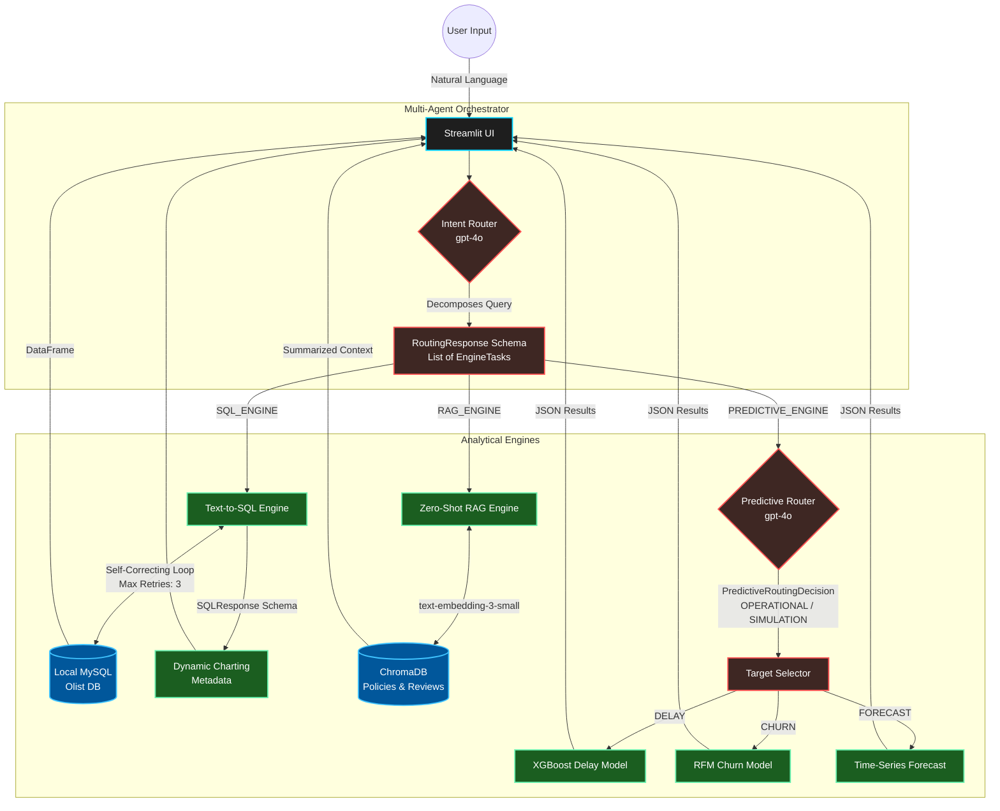

# 🧠 Agentic Data Intelligence Hub
A multi-agent analytics orchestration system built over the Olist E-commerce dataset. Designed to process complex natural language queries, decompose them into actionable sub-tasks, and autonomously route them to specialized analytical engines (SQL, RAG, and Machine Learning pipelines).

This project abandons fragile prompt-chaining in favor of strict, schema-enforced routing using `gpt-4o` and Pydantic, ensuring deterministic execution for data retrieval and machine learning inferences.
   

## 🏗️ System Architecture

## 🧠 Core Orchestration & Engines

### 1. Multi-Agent Query Decomposition (`intent_router.py`)
Instead of relying on a single monolithic LLM call, the system employs a Master Orchestrator. It ingests natural language, determines the required analytical engines, and decomposes multi-faceted prompts into specific sub-queries.
* **Strict Typing:** Outputs a strict `RoutingResponse` schema containing isolated `EngineTask` objects.
* **Target Isolation:** Rewrites sub-queries so the target engine only receives the exact context it is responsible for answering.

### 2. Autonomous Text-to-SQL Engine (`sql_engine.py`)
A self-correcting database agent connected to a local MySQL instance containing historical e-commerce data.
* **Dynamic Temporal Anchoring:** Caches the `MAX(order_date)` from the database to physically prevent the LLM from hallucinating present-day temporal assumptions on a 2018 dataset.
* **Self-Correction Loop:** If a syntax error occurs during execution, the engine feeds the MySQL stack trace back to the LLM for autonomous debugging before throwing an exception to the UI (Max Retries: 3).
* **Dynamic Visualization Metadata:** Enforces a `SQLResponse` schema that natively dictates rendering instructions, automatically deciding between line, bar, or scatter charts and mapping X/Y axes based on the SQL output.

### 3. Machine Learning Predictive Router (`router.py`)
A specialized routing layer handling machine learning tasks via a `PredictiveRoutingDecision` schema, directing traffic to Scikit-Learn and XGBoost models.
* **Dual-Mode Execution:** Dynamically toggles between `OPERATIONAL` mode (executing inferences on live database alphanumeric IDs) and `SIMULATION` mode (parsing hypothetical features like freight weight, volume, and interstate logistics for "what-if" scenarios).
* **Pipelines Supported:** Delivery Delay Prediction (XGBoost), RFM Churn Analysis, and Time-Series Forecasting.

### 4. Zero-Shot Cross-Lingual RAG (`ingest_policies.py`)
A retrieval-augmented generation engine built on ChromaDB, designed to synthesize unstructured Portuguese operational text into English summaries.
* **Semantic Chunking:** Utilizes regex lookaheads to split text strictly at corporate section headers, maintaining document hierarchy and context.
* **LLM Metadata Tagging:** Passes raw chunks to an LLM to generate descriptive headers and brief summaries before embedding (`text-embedding-3-small`), vastly improving vector retrieval accuracy.

## 💻 Local Development Environment
This architecture was engineered for heavy local compute to facilitate the testing of air-gapped, open-source models. 

* **Hardware:** NVIDIA RTX 4080 (12GB VRAM)
* **Stack:** Python 3.10, Streamlit, PyCharm, MySQL, ChromaDB
* **Future Integration:** Currently branching to swap OpenAI APIs with a local Ollama server running Llama-3-8B.